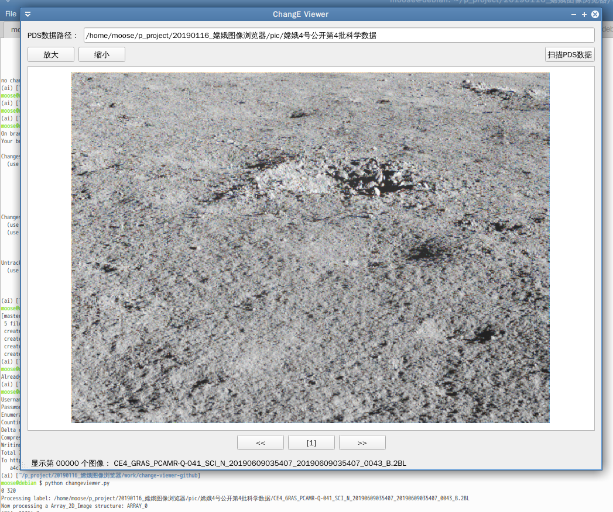

# change-viewer
An image viewer for opening and browsing .2B files of ChangE4 project published by NAOC

# 嫦娥探月数据浏览

1[双目示例-远望嫦娥4](sbs_C_0076.png)


## 快速体验

`test`文件夹中包含了一个简短的例子，可以将2B数据文件另存为图片。

## 1. 数据网站

[探月工程数据发布与信息服务系统](http://moon.bao.ac.cn/)

## 2. 注册用户

注册成功之后会发一封邮件到邮箱，其中有登录密码，保存好。

## 3. 下载PDS数据

登录之后，PDS数据可以单独下载也可以按数据集打包下载。 

下载的数据文件扩展名为`.2A`、`.2B`、`.2C`，实际为`pds`格式。

## 4. 运行浏览器

首先安装依赖包

```
pip install PyQt5 pds4-tools colour colour-demosaicing scikit-image --upgrade
```

运行浏览器

```
python changeviewer.py
```



## 附录：CE-4数据产品文件命名规则

嫦娥四号数据产品的文件名称采用如下格式进行命名：

    CEx_st_pl_ty_dc_yyyymmddhhmiss_YYYYMMDDHHMISS_ob_ver.lv

其中，文件名中用“_”分隔的各个字段所表示的含义如下：

（1）CEx为任务标识。其中：

|  任务标识   |     	含义     |                	备注                 |
| ---------- | ------------ | ------------------------------------ |
| CE4        | 嫦娥四号      | 用于1级、2级数据                       |
| CE4-La     | 嫦娥四号着陆器 | 用于着陆器上搭载载荷的0级数据            |
| CE4-Ro 	 | 嫦娥四号巡视器 | 用于巡视器上搭载载荷的0级数据            |
| CE4-Re 	 | 嫦娥四号中继星 | 用于中继星上搭载的低频射电探测仪的0级数据 |

（2）st为数据来源（接收站）编号

| 数据来源 |        	含义        |
| ------- | ----------------- |
| GRAS1   | 北京密云站GRAS1天线 |
| GRAS2   | 云南昆明站GRAS2天线 |
| GRAS3   | 北京密云站GRAS3天线 |
| BACC    | 测控系统天线        |
| GRAS    | 优化后             |

（3）pl为探测仪器缩写。

嫦娥四号所搭载的各科学载荷的名称缩写，以及各载荷参数的含义如下：

|  平台  | 缩写 |        载荷名称        | 载荷参数 |      载荷参数说明       |
| ----- | ---- | --------------------- | ------- | --------------------- |
| 着陆器 | TCAM | 地形地貌相机            | TCAM-I  | 地形地貌相机静态拍照模式 |
| -     | -    | -                     | TCAM-A  | 地形地貌相机动态摄像模式 |
| -     | LCAM | 降落相机               | LCAM-1  | 降落相机模式一（8:1）   |
| -     | -    | -                     | LCAM-2  | 降落相机模式二（64:1）  |
| -     | LND  | 月表中子与辐射剂量探测仪 | -       | -                     |
| 巡视器 | PCAM | 全景相机               | PCAML-C | 全景相机A彩色图像       |
| -     | -    | -                     | PCAML-Q | 全景相机A全色图像       |
PCAML-C 	全景相机B彩色图像
PCAML-Q 	全景相机B全色图像
VNIS 	红外成像光谱仪 	VNIS-SD 	红外成像光谱仪-短波红外波段探测模式
VNIS-SC 	红外成像光谱仪-短波红外波段定标模式
VNIS-VD 	红外成像光谱仪-可见近红外波段探测模式
VNIS-VC 	红外成像光谱仪-可见近红外波段定标模式
LPR 	测月雷达 	LPR-1 	测月雷达科学数据第一通道
LPR-2A 	测月雷达科学数据第二通道天线A
LPR-2B 	测月雷达科学数据第二通道天线B
ASAN 	中性原子探测仪 	- 	-
中继星 	NCLE 	低频射电探测仪 	- 	-

（4）ty表示数据产品类型，取值为：

| 数据产品类型缩写 |    含义     |
| -------------- | ----------- |
| SCI            | 科学数据产品 |
| AUX            | 辅助数据产品 |

（5）dc表示数据时间特性。

| 数据时间特性 |          含义          |
| ----------- | --------------------- |
| R           | 实时数据               |
| P           | 回放数据               |
| N           | 不可分辨数据（混合数据） |

（6） yyyymmddhhmiss和YYYYMMDDMISS文件名时间码含义:

    0A级、0B级数据文件名中起止时间为数据获取的起止时间（世界时）;
    1级数据文件名起止时间为探测周期的起止时间（世界时）;
    图像数据起止时间相同，皆为本帧图像的获取时间（世界时）.

（7）ob为探测周期序号，占4个字符。

（8）ver表示产品版本。取值A~Z，第一版为‘A’，最后一版位‘Z’。

（10）lv表示产品级别。各产品级别及其所做的数据处理如下：

    0A——0A级数据产品
    0B——0B级数据产品
    01——1 级科学数据产品；01L——1 级数据产品标签
    2A——2A级数据产品；2AL——2A级数据产品标签
    2B——2B级数据产品；2BL——2B级数据产品标签
    2C——2C级数据产品；2CL——2C级数据产品标签
